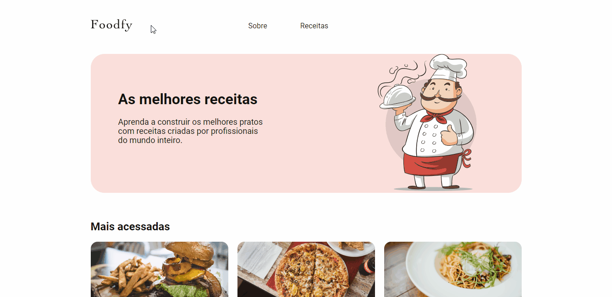

<h1 align="center">
    
</h1>

<h3 align="center">
  Desafio: Construindo Foodfy
</h3>

<blockquote align="center">“Sua única limitação é você mesmo!”</blockquote>

  

## :rocket: Sobre o desafio

Construir um site completo para uma empresa de receitas chamada Foodfy.

  

### Dicas e regras

- Na página de receitas, quando o usuário clica em uma receita, um modal deve aparecer em tela contendo as mesmas informações da receita que ele clicou;

## :clapper: Demo
Os GIFs abaixo mostram o site em ação:

  

  

